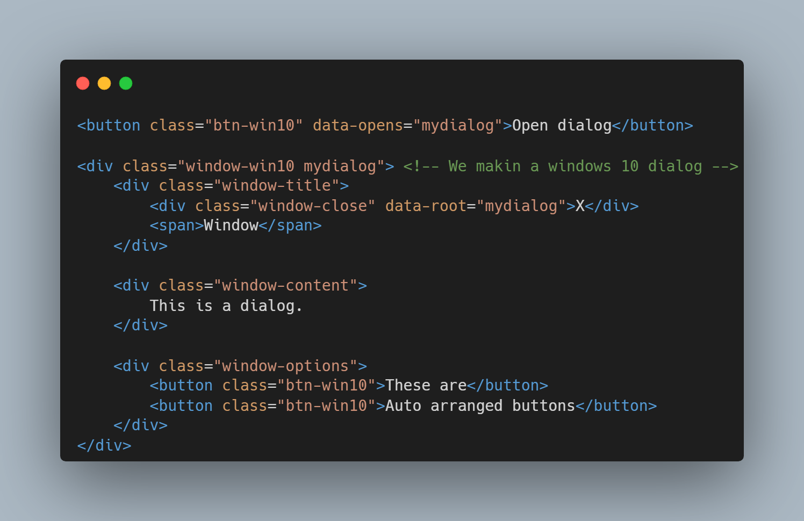

# Welcome To The StyleX Tutorial.
### This will guide you thru how to use stylex for your forms.

# Table of contents
- [Setup](#setup)
- [Basic widgets](#basic-widgets)
- [Dialogs](#dialogs)

# Setup
1. Install StyleX from its [GitHub](https://github.com/devpython88/StyleX)
2. Copy and paste the `css` and `js` folders into your website folder.
3. Link the files. 
CSS: `<link href="css/stylex.css"><link "href=css/stylex_windows_10.css">` 
JS: `<script src="js/stylex.js">`

# Basic Widgets
To create a styled button.
1. Create a button with the classes:
	- btn
		- Needed because otherwise no styling.
	- btn-glow
		- Optional, But good because it adds a shadow on hover.
	- btn-trans
		- Also optional, But makes the transition smoother (like the shadow from btn-glow)
2. If you want to make it look like windows 10
	- btn-win10
		- Needed because otherwise no styling.

3. If you want to make it look like Android
	- btn-android
		- Needed because otherwise no styling.

---
To create a styled Entry.
1. Create an Entry with the classes:
	- entry
		- Needed because otherwise no styling.
	- entry-glow
		- Optional, But good because it adds a shadow on hover.
	- entry-trans
		- Also optional, But makes the transition smoother (like the shadow from entry-glow)
	
2. If you want to make it look like windows 10.
	- entry-win10
		- Needed because otherwise no styling.
	
3. If you want to make it look like Android
	- entry-android
		- Needed because otherwise no styling.

---
To create a toggle button.
1. Create a div with the class .checkbutton
2. Add a div inside it with the class .cball
3. Link js/stylex.js, Otherwise the toggle button wont work.

And if you linked stylex.js with the website, you can use the isCheckButtonChecked function to check if the toggle button is chekded or not.

# Dialogs
Dialogs are easy to make in StyleX.
Structure :
- .window (or .window-win10 for windwos 10 look, .window-android for android look)
	- .window-title
		- .window-close
			- data-root = "{dialog-class-name}" Replace this with one of the class names of the dialog div. This'll make it so the dialog closes when this is clicked.
			- text = ""
				- If you are makign a win 10 style window, then add a 'X' here.
		- span
			- Use for title (don't use `p` or other blocks)
	- .window-content
		- add yo content here.
	
	- .window-options
		- Add some [styled buttons](#basic-widgets) here. 	They will automatically be arranged.

You can also add a `data-opens` attribute to a button to make it open a specific dialog.

Example:

